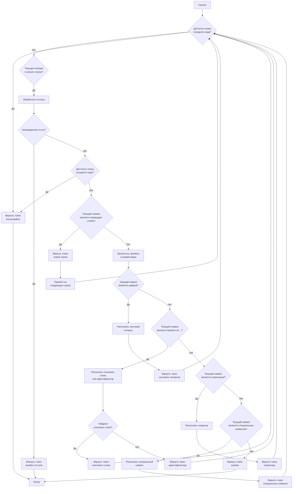
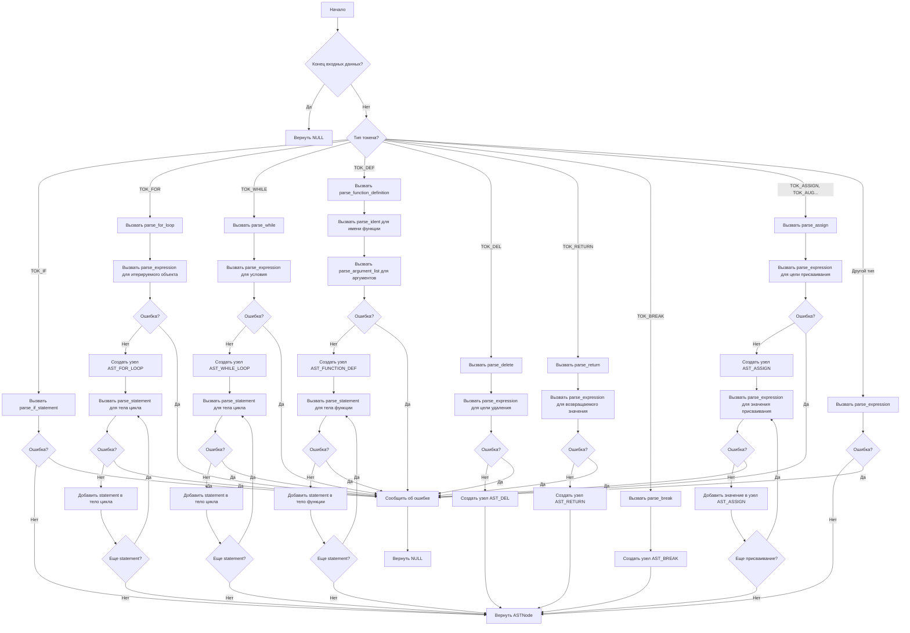
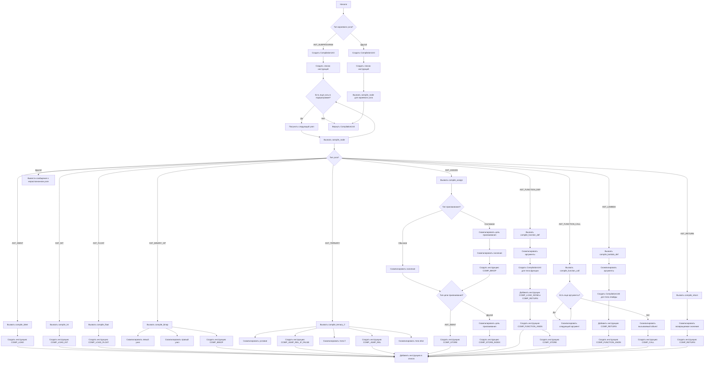
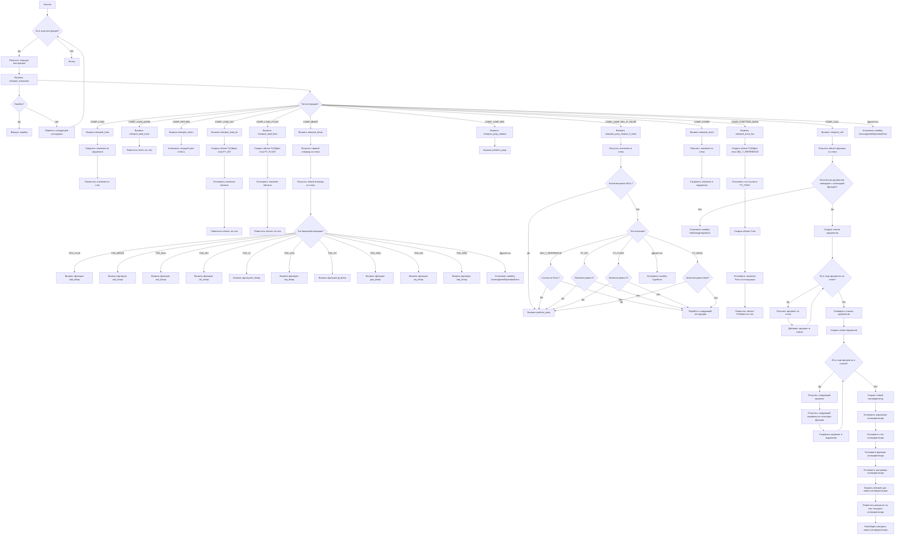

### Запуск канонических тестов
Тесты описываются python скриптами (`.py`), лежащими в каталоге `tests/`
Необходимо иметь установленные и добавленные в `PATH` `python (>= 3.10)`, а также `java (> 1.8)`
Также необходимо установить переменную окружения `$RARS_JAR_FILE` -- путь до исполняемого `.jar` файла RARS
В случае отсутсвия такого, скрипт потребует ввести путь до него.
- Канонизация:
    ```bash
    python run_tests.py -Z
    ```
    После этого в папке tests/canondata, для каждого из тестового файла появится его канонизация
- Обычный тест, сверяющий с канонизацией:
    ```bash
    python run_tests.py
    ```

## Алгоритм получения нового токена



## Алгоритм разбора выражений



## Алгоритм компиляции дерева в промежуточное представление



## Алгоритм интерпретации промежуточного представления


