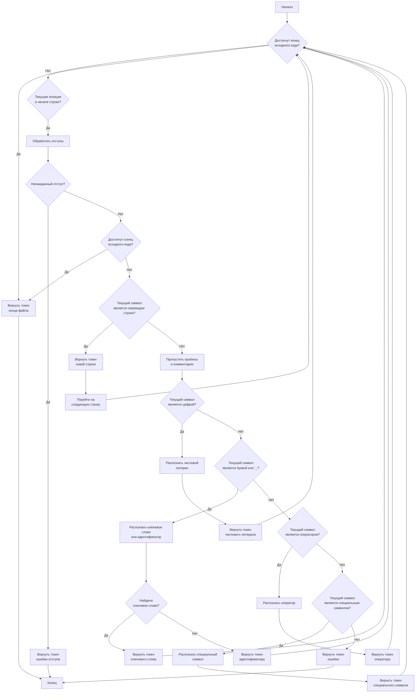

## Алгоритм получения нового токена

```mermaid
graph TD
    A[Начало] --> B{Достигнут конец<br>исходного кода?}
    B -- Да --> C[Вернуть токен<br>конца файла]
    C --> D[Конец]
    B -- Нет --> E{Текущая позиция<br>в начале строки?}
    E -- Да --> F[Обработать отступы]
    F --> G{Неожиданный отступ?}
    G -- Да --> H[Вернуть токен<br>ошибки отступа]
    H --> D
    G -- Нет --> I{Достигнут конец<br>исходного кода?}
    I -- Да --> C
    I -- Нет --> J{Текущий символ<br>является переводом строки?}
    J -- Да --> K[Вернуть токен<br>новой строки]
    K --> L[Перейти на<br>следующую строку]
    L --> B
    J -- Нет --> M[Пропустить пробелы<br>и комментарии]
    M --> N{Текущий символ<br>является цифрой?}
    N -- Да --> O[Распознать числовой<br>литерал]
    O --> P[Вернуть токен<br>числового литерала]
    P --> B
    N -- Нет --> Q{Текущий символ<br>является буквой или '_'?}
    Q -- Да --> R[Распознать ключевое слово<br>или идентификатор]
    R --> S{Найдено<br>ключевое слово?}
    S -- Да --> T[Вернуть токен<br>ключевого слова]
    T --> B
    S -- Нет --> U[Вернуть токен<br>идентификатора]
    U --> B
    Q -- Нет --> V{Текущий символ<br>является оператором?}
    V -- Да --> W[Распознать оператор]
    W --> X[Вернуть токен<br>оператора]
    X --> B
    V -- Нет --> Y{Текущий символ<br>является специальным символом?}
    Y -- Да --> Z[Распознать специальный<br>символ]
    Z --> AA[Вернуть токен<br>специального символа]
    AA --> B
    Y -- Нет --> AB[Вернуть токен<br>ошибки]
    AB --> D
```
